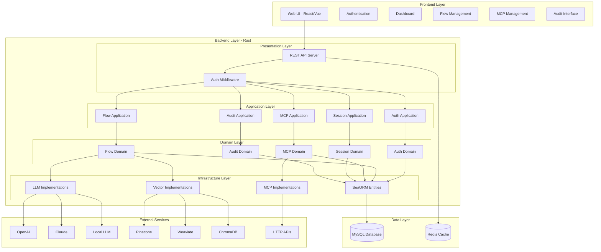

# Design Document

## Overview

本设计文档描述了一个完整的agent平台系统架构，该平台采用Rust后端单实例架构配合MySQL数据库，前端使用现代Web技术栈。系统核心功能包括agent流程执行、Dify DSL导入、版本管理、多模型集成、MCP工具代理、用户认证和审计等。

## Architecture

### 系统架构图



### 技术栈选择

**后端技术栈:**
- **语言**: Rust (性能优异，内存安全)
- **Web框架**: Axum (现代异步Web框架)
- **数据库**: MySQL 8.0+ (关系型数据，支持JSON字段)
- **ORM**: SeaORM (类型安全的异步ORM)
- **缓存**: Redis (会话缓存，性能优化)
- **认证**: JWT + bcrypt (安全的token认证)
- **序列化**: serde (JSON/YAML处理)
- **异步运行时**: tokio (高性能异步处理)

**前端技术栈:**
- **框架**: React 18+ with TypeScript
- **状态管理**: Zustand
- **UI组件**: Tailwind CSS + Headless UI
- **路由**: React Router v6
- **HTTP客户端**: Axios
- **构建工具**: Vite

## Components and Interfaces

### 分层架构设计

#### 领域驱动设计 (DDD) 分层

**Presentation Layer (表现层)**
- REST API控制器
- 请求/响应模型转换
- 认证和授权中间件

**Application Layer (应用层)**
- 应用服务协调业务流程
- 事务管理
- 外部服务集成

**Domain Layer (领域层)**
- 业务实体和值对象
- 领域服务和业务规则
- 领域事件

**Infrastructure Layer (基础设施层)**
- SeaORM实体和仓储实现
- 外部API客户端
- 缓存和消息队列

### 核心组件设计

#### 1. Flow Domain (流程领域)

```rust
// 领域实体
pub struct Flow {
    pub id: FlowId,
    pub tenant_id: TenantId,
    pub name: FlowName,
    pub version: Version,
    pub definition: FlowDefinition,
    pub status: FlowStatus,
    pub created_by: UserId,
    pub created_at: DateTime<Utc>,
}

// 领域服务
pub trait FlowDomainService {
    fn validate_flow(&self, flow: &Flow) -> Result<ValidationResult>;
    fn can_execute(&self, flow: &Flow, user: &User) -> bool;
    fn create_execution_context(&self, flow: &Flow, user: &User) -> ExecutionContext;
}

// 领域仓储接口
pub trait FlowRepository {
    async fn find_by_id(&self, id: FlowId) -> Result<Option<Flow>>;
    async fn save(&self, flow: &Flow) -> Result<()>;
    async fn find_by_tenant(&self, tenant_id: TenantId) -> Result<Vec<Flow>>;
}

// 应用服务
pub struct FlowApplicationService {
    flow_repo: Arc<dyn FlowRepository>,
    flow_domain_service: Arc<dyn FlowDomainService>,
    execution_engine: Arc<dyn ExecutionEngine>,
}

impl FlowApplicationService {
    pub async fn execute_flow(&self, command: ExecuteFlowCommand) -> Result<FlowExecution> {
        let flow = self.flow_repo.find_by_id(command.flow_id).await?
            .ok_or(FlowNotFound)?;
        
        if !self.flow_domain_service.can_execute(&flow, &command.user) {
            return Err(UnauthorizedExecution);
        }
        
        let context = self.flow_domain_service.create_execution_context(&flow, &command.user);
        self.execution_engine.execute(flow, context).await
    }
}
```

#### 2. LLM Domain (大模型领域)

```rust
// 领域值对象
#[derive(Debug, Clone)]
pub struct ModelConfig {
    pub provider: ModelProvider,
    pub model_name: String,
    pub parameters: ModelParameters,
}

#[derive(Debug, Clone)]
pub struct ChatMessage {
    pub role: MessageRole,
    pub content: String,
    pub metadata: Option<MessageMetadata>,
}

// 领域服务接口
pub trait LLMDomainService {
    async fn chat_completion(&self, config: &ModelConfig, messages: Vec<ChatMessage>) -> Result<ChatResponse>;
    async fn generate_embedding(&self, config: &ModelConfig, text: &str) -> Result<Vec<f32>>;
    fn validate_config(&self, config: &ModelConfig) -> Result<()>;
}

// 基础设施层实现
pub trait LLMProvider: Send + Sync {
    async fn chat_completion(&self, request: ChatRequest) -> Result<ChatResponse>;
    async fn embedding(&self, text: &str) -> Result<Vec<f32>>;
    fn model_info(&self) -> ModelInfo;
    fn supports_streaming(&self) -> bool;
}

// 具体实现
pub struct OpenAIProvider { /* ... */ }
pub struct ClaudeProvider { /* ... */ }
pub struct LocalLLMProvider { /* ... */ }

// 领域服务实现
pub struct LLMDomainServiceImpl {
    providers: HashMap<ModelProvider, Arc<dyn LLMProvider>>,
}
```

#### 3. Vector Database Abstraction (向量数据库抽象)

```rust
pub trait VectorStore: Send + Sync {
    async fn upsert(&self, vectors: Vec<VectorRecord>) -> Result<()>;
    async fn query(&self, vector: Vec<f32>, top_k: usize, filter: Option<Filter>) -> Result<Vec<SearchResult>>;
    async fn delete(&self, ids: Vec<String>) -> Result<()>;
    async fn create_index(&self, config: IndexConfig) -> Result<()>;
}

pub struct VectorRecord {
    pub id: String,
    pub vector: Vec<f32>,
    pub metadata: HashMap<String, Value>,
    pub tenant_id: Uuid,
}

// 具体实现
pub struct PineconeStore { /* ... */ }
pub struct WeaviateStore { /* ... */ }
pub struct ChromaDBStore { /* ... */ }
```

#### 4. MCP Host Service (MCP主机服务)

```rust
pub trait MCPHost {
    async fn list_tools(&self, tenant_id: Uuid) -> Result<Vec<MCPTool>>;
    async fn call_tool(&self, tool_id: Uuid, params: Value, context: CallContext) -> Result<ToolResult>;
    async fn register_http_tool(&self, config: HTTPToolConfig) -> Result<Uuid>;
    async fn update_tool_version(&self, tool_id: Uuid, version: i32) -> Result<()>;
}

pub struct HTTPToolConfig {
    pub name: String,
    pub description: String,
    pub endpoint: String,
    pub method: HttpMethod,
    pub headers: HashMap<String, String>,
    pub parameters: Vec<ParameterSchema>,
    pub response_schema: Option<JsonSchema>,
    pub tenant_id: Uuid,
}

pub struct MCPTool {
    pub id: Uuid,
    pub name: String,
    pub description: String,
    pub version: i32,
    pub schema: ToolSchema,
    pub config: ToolConfig,
}
```

#### 5. Version Management (版本管理)

```rust
pub trait VersionManager<T> {
    async fn create_version(&self, entity: &T) -> Result<Version<T>>;
    async fn get_version(&self, entity_id: Uuid, version: i32) -> Result<Option<Version<T>>>;
    async fn list_versions(&self, entity_id: Uuid) -> Result<Vec<VersionInfo>>;
    async fn rollback(&self, entity_id: Uuid, target_version: i32) -> Result<Version<T>>;
    async fn compare_versions(&self, entity_id: Uuid, v1: i32, v2: i32) -> Result<VersionDiff>;
}

pub struct Version<T> {
    pub id: Uuid,
    pub entity_id: Uuid,
    pub version: i32,
    pub data: T,
    pub created_at: DateTime<Utc>,
    pub created_by: Uuid,
    pub change_log: String,
}
```

### API接口设计

#### 认证相关接口

```
POST /api/auth/login
Body: { tenant_id: string, username: string, password: string }
Response: { token: string, user: UserInfo, expires_at: string }

POST /api/auth/refresh
Header: Authorization: Bearer <token>
Response: { token: string, expires_at: string }

POST /api/auth/logout
Header: Authorization: Bearer <token>
Response: { success: boolean }
```

#### 流程管理接口

```
GET /api/flows
Query: tenant_id, page, limit
Response: { flows: Flow[], total: number }

POST /api/flows/import-dsl
Body: { dsl: string, name: string }
Response: { flow: Flow, validation: ValidationResult }

POST /api/flows/{id}/execute
Body: { variables: object, session_id?: string }
Response: { execution_id: string, status: string }

GET /api/flows/{id}/versions
Response: { versions: VersionInfo[] }

POST /api/flows/{id}/rollback
Body: { target_version: number }
Response: { flow: Flow, success: boolean }
```

#### MCP工具接口

```
GET /api/mcp/tools
Response: { tools: MCPTool[] }

POST /api/mcp/tools
Body: HTTPToolConfig
Response: { tool: MCPTool }

POST /api/mcp/tools/{id}/call
Body: { parameters: object }
Response: { result: any, execution_time: number }

GET /api/mcp/tools/{id}/versions
Response: { versions: VersionInfo[] }
```

## Data Models

### SeaORM实体设计

#### 用户和租户实体

```rust
// SeaORM实体定义
use sea_orm::entity::prelude::*;

#[derive(Clone, Debug, PartialEq, DeriveEntityModel)]
#[sea_orm(table_name = "tenants")]
pub struct Model {
    #[sea_orm(primary_key, auto_increment = false)]
    pub id: Uuid,
    pub name: String,
    pub created_at: DateTime<Utc>,
    pub updated_at: DateTime<Utc>,
}

#[derive(Copy, Clone, Debug, EnumIter, DeriveRelation)]
pub enum Relation {
    #[sea_orm(has_many = "super::user::Entity")]
    Users,
}

impl Related<super::user::Entity> for Entity {
    fn to() -> RelationDef {
        Relation::Users.def()
    }
}

impl ActiveModelBehavior for ActiveModel {}

// 用户实体
#[derive(Clone, Debug, PartialEq, DeriveEntityModel)]
#[sea_orm(table_name = "users")]
pub struct Model {
    #[sea_orm(primary_key, auto_increment = false)]
    pub id: Uuid,
    pub tenant_id: Uuid,
    pub username: String,
    pub nickname: Option<String>,
    pub password_hash: String,
    pub created_at: DateTime<Utc>,
    pub updated_at: DateTime<Utc>,
}

#[derive(Copy, Clone, Debug, EnumIter, DeriveRelation)]
pub enum Relation {
    #[sea_orm(
        belongs_to = "super::tenant::Entity",
        from = "Column::TenantId",
        to = "super::tenant::Column::Id"
    )]
    Tenant,
}

impl Related<super::tenant::Entity> for Entity {
    fn to() -> RelationDef {
        Relation::Tenant.def()
    }
}

impl ActiveModelBehavior for ActiveModel {}
```

#### 数据库迁移

```sql
CREATE TABLE tenants (
    id CHAR(36) PRIMARY KEY,
    name VARCHAR(255) NOT NULL,
    created_at TIMESTAMP DEFAULT CURRENT_TIMESTAMP,
    updated_at TIMESTAMP DEFAULT CURRENT_TIMESTAMP ON UPDATE CURRENT_TIMESTAMP,
    INDEX idx_name (name)
);

CREATE TABLE users (
    id CHAR(36) PRIMARY KEY,
    tenant_id CHAR(36) NOT NULL,
    username VARCHAR(255) NOT NULL,
    nickname VARCHAR(255),
    password_hash VARCHAR(255) NOT NULL,
    created_at TIMESTAMP DEFAULT CURRENT_TIMESTAMP,
    updated_at TIMESTAMP DEFAULT CURRENT_TIMESTAMP ON UPDATE CURRENT_TIMESTAMP,
    FOREIGN KEY (tenant_id) REFERENCES tenants(id),
    UNIQUE KEY uk_tenant_username (tenant_id, username),
    INDEX idx_tenant_id (tenant_id)
);
```

#### 流程相关表

```sql
CREATE TABLE flows (
    id CHAR(36) PRIMARY KEY,
    tenant_id CHAR(36) NOT NULL,
    name VARCHAR(255) NOT NULL,
    description TEXT,
    current_version INT DEFAULT 1,
    status ENUM('Draft', 'Active', 'Archived') DEFAULT 'Draft',
    created_by CHAR(36) NOT NULL,
    created_at TIMESTAMP DEFAULT CURRENT_TIMESTAMP,
    updated_at TIMESTAMP DEFAULT CURRENT_TIMESTAMP ON UPDATE CURRENT_TIMESTAMP,
    FOREIGN KEY (tenant_id) REFERENCES tenants(id),
    FOREIGN KEY (created_by) REFERENCES users(id),
    INDEX idx_tenant_id (tenant_id),
    INDEX idx_status (status)
);

CREATE TABLE flow_versions (
    id CHAR(36) PRIMARY KEY,
    flow_id CHAR(36) NOT NULL,
    version INT NOT NULL,
    definition JSON NOT NULL,
    change_log TEXT,
    created_by CHAR(36) NOT NULL,
    created_at TIMESTAMP DEFAULT CURRENT_TIMESTAMP,
    FOREIGN KEY (flow_id) REFERENCES flows(id) ON DELETE CASCADE,
    FOREIGN KEY (created_by) REFERENCES users(id),
    UNIQUE KEY uk_flow_version (flow_id, version),
    INDEX idx_flow_id (flow_id)
);
```

#### 执行和会话表

```sql
CREATE TABLE flow_executions (
    id CHAR(36) PRIMARY KEY,
    flow_id CHAR(36) NOT NULL,
    flow_version INT NOT NULL,
    tenant_id CHAR(36) NOT NULL,
    user_id CHAR(36) NOT NULL,
    session_id CHAR(36),
    status ENUM('pending', 'running', 'completed', 'failed', 'cancelled') DEFAULT 'pending',
    input_data JSON,
    output_data JSON,
    error_message TEXT,
    started_at TIMESTAMP DEFAULT CURRENT_TIMESTAMP,
    completed_at TIMESTAMP NULL,
    execution_time_ms INT,
    FOREIGN KEY (flow_id) REFERENCES flows(id),
    FOREIGN KEY (tenant_id) REFERENCES tenants(id),
    FOREIGN KEY (user_id) REFERENCES users(id),
    INDEX idx_tenant_id (tenant_id),
    INDEX idx_user_id (user_id),
    INDEX idx_session_id (session_id),
    INDEX idx_status (status),
    INDEX idx_started_at (started_at)
);

CREATE TABLE chat_sessions (
    id CHAR(36) PRIMARY KEY,
    tenant_id CHAR(36) NOT NULL,
    user_id CHAR(36) NOT NULL,
    title VARCHAR(255),
    context JSON,
    created_at TIMESTAMP DEFAULT CURRENT_TIMESTAMP,
    updated_at TIMESTAMP DEFAULT CURRENT_TIMESTAMP ON UPDATE CURRENT_TIMESTAMP,
    FOREIGN KEY (tenant_id) REFERENCES tenants(id),
    FOREIGN KEY (user_id) REFERENCES users(id),
    INDEX idx_tenant_user (tenant_id, user_id),
    INDEX idx_updated_at (updated_at)
);

CREATE TABLE chat_messages (
    id CHAR(36) PRIMARY KEY,
    session_id CHAR(36) NOT NULL,
    role ENUM('user', 'assistant', 'system') NOT NULL,
    content TEXT NOT NULL,
    metadata JSON,
    created_at TIMESTAMP DEFAULT CURRENT_TIMESTAMP,
    FOREIGN KEY (session_id) REFERENCES chat_sessions(id) ON DELETE CASCADE,
    INDEX idx_session_id (session_id),
    INDEX idx_created_at (created_at)
);
```

#### MCP工具表

```sql
CREATE TABLE mcp_tools (
    id CHAR(36) PRIMARY KEY,
    tenant_id CHAR(36) NOT NULL,
    name VARCHAR(255) NOT NULL,
    description TEXT,
    current_version INT DEFAULT 1,
    status ENUM('active', 'inactive') DEFAULT 'active',
    created_by CHAR(36) NOT NULL,
    created_at TIMESTAMP DEFAULT CURRENT_TIMESTAMP,
    updated_at TIMESTAMP DEFAULT CURRENT_TIMESTAMP ON UPDATE CURRENT_TIMESTAMP,
    FOREIGN KEY (tenant_id) REFERENCES tenants(id),
    FOREIGN KEY (created_by) REFERENCES users(id),
    UNIQUE KEY uk_tenant_name (tenant_id, name),
    INDEX idx_tenant_id (tenant_id)
);

CREATE TABLE mcp_tool_versions (
    id CHAR(36) PRIMARY KEY,
    tool_id CHAR(36) NOT NULL,
    version INT NOT NULL,
    config JSON NOT NULL,
    change_log TEXT,
    created_by CHAR(36) NOT NULL,
    created_at TIMESTAMP DEFAULT CURRENT_TIMESTAMP,
    FOREIGN KEY (tool_id) REFERENCES mcp_tools(id) ON DELETE CASCADE,
    FOREIGN KEY (created_by) REFERENCES users(id),
    UNIQUE KEY uk_tool_version (tool_id, version),
    INDEX idx_tool_id (tool_id)
);
```

#### 配置和审计表

```sql
CREATE TABLE llm_configs (
    id CHAR(36) PRIMARY KEY,
    tenant_id CHAR(36) NOT NULL,
    name VARCHAR(255) NOT NULL,
    provider VARCHAR(100) NOT NULL,
    config JSON NOT NULL,
    is_default BOOLEAN DEFAULT FALSE,
    created_at TIMESTAMP DEFAULT CURRENT_TIMESTAMP,
    updated_at TIMESTAMP DEFAULT CURRENT_TIMESTAMP ON UPDATE CURRENT_TIMESTAMP,
    FOREIGN KEY (tenant_id) REFERENCES tenants(id),
    UNIQUE KEY uk_tenant_name (tenant_id, name),
    INDEX idx_tenant_id (tenant_id)
);

CREATE TABLE vector_configs (
    id CHAR(36) PRIMARY KEY,
    tenant_id CHAR(36) NOT NULL,
    name VARCHAR(255) NOT NULL,
    provider VARCHAR(100) NOT NULL,
    config JSON NOT NULL,
    is_default BOOLEAN DEFAULT FALSE,
    created_at TIMESTAMP DEFAULT CURRENT_TIMESTAMP,
    updated_at TIMESTAMP DEFAULT CURRENT_TIMESTAMP ON UPDATE CURRENT_TIMESTAMP,
    FOREIGN KEY (tenant_id) REFERENCES tenants(id),
    UNIQUE KEY uk_tenant_name (tenant_id, name),
    INDEX idx_tenant_id (tenant_id)
);

CREATE TABLE audit_logs (
    id CHAR(36) PRIMARY KEY,
    tenant_id CHAR(36) NOT NULL,
    user_id CHAR(36),
    action VARCHAR(100) NOT NULL,
    resource_type VARCHAR(100) NOT NULL,
    resource_id CHAR(36),
    details JSON,
    ip_address VARCHAR(45),
    user_agent TEXT,
    created_at TIMESTAMP DEFAULT CURRENT_TIMESTAMP,
    FOREIGN KEY (tenant_id) REFERENCES tenants(id),
    FOREIGN KEY (user_id) REFERENCES users(id),
    INDEX idx_tenant_id (tenant_id),
    INDEX idx_user_id (user_id),
    INDEX idx_action (action),
    INDEX idx_resource (resource_type, resource_id),
    INDEX idx_created_at (created_at)
);
```

## Error Handling

### 错误处理策略

```rust
#[derive(Debug, thiserror::Error)]
pub enum PlatformError {
    #[error("Authentication failed: {0}")]
    AuthenticationFailed(String),
    
    #[error("Authorization failed: {0}")]
    AuthorizationFailed(String),
    
    #[error("Flow execution failed: {0}")]
    FlowExecutionFailed(String),
    
    #[error("DSL parsing failed: {0}")]
    DSLParsingFailed(String),
    
    #[error("LLM provider error: {0}")]
    LLMProviderError(String),
    
    #[error("Vector store error: {0}")]
    VectorStoreError(String),
    
    #[error("MCP tool error: {0}")]
    MCPToolError(String),
    
    #[error("Database error: {0}")]
    DatabaseError(#[from] sqlx::Error),
    
    #[error("Validation error: {0}")]
    ValidationError(String),
    
    #[error("Not found: {0}")]
    NotFound(String),
    
    #[error("Internal server error: {0}")]
    InternalError(String),
}

impl IntoResponse for PlatformError {
    fn into_response(self) -> Response {
        let (status, error_message) = match self {
            PlatformError::AuthenticationFailed(_) => (StatusCode::UNAUTHORIZED, self.to_string()),
            PlatformError::AuthorizationFailed(_) => (StatusCode::FORBIDDEN, self.to_string()),
            PlatformError::NotFound(_) => (StatusCode::NOT_FOUND, self.to_string()),
            PlatformError::ValidationError(_) => (StatusCode::BAD_REQUEST, self.to_string()),
            _ => (StatusCode::INTERNAL_SERVER_ERROR, "Internal server error".to_string()),
        };

        let body = Json(json!({
            "error": error_message,
            "timestamp": Utc::now().to_rfc3339()
        }));

        (status, body).into_response()
    }
}
```

### 重试和降级机制

```rust
pub struct RetryConfig {
    pub max_attempts: u32,
    pub base_delay: Duration,
    pub max_delay: Duration,
    pub backoff_multiplier: f64,
}

pub async fn with_retry<F, T, E>(
    operation: F,
    config: &RetryConfig,
) -> Result<T, E>
where
    F: Fn() -> Pin<Box<dyn Future<Output = Result<T, E>> + Send>>,
    E: std::fmt::Debug,
{
    let mut delay = config.base_delay;
    
    for attempt in 1..=config.max_attempts {
        match operation().await {
            Ok(result) => return Ok(result),
            Err(e) if attempt == config.max_attempts => return Err(e),
            Err(e) => {
                log::warn!("Attempt {} failed: {:?}, retrying in {:?}", attempt, e, delay);
                tokio::time::sleep(delay).await;
                delay = std::cmp::min(
                    Duration::from_millis((delay.as_millis() as f64 * config.backoff_multiplier) as u64),
                    config.max_delay,
                );
            }
        }
    }
    
    unreachable!()
}
```

## Testing Strategy

### 测试层次结构

1. **单元测试**: 测试各个组件的核心逻辑
2. **集成测试**: 测试组件间的交互
3. **端到端测试**: 测试完整的用户流程
4. **性能测试**: 测试系统在负载下的表现

### 测试工具和框架

```rust
// 单元测试示例
#[cfg(test)]
mod tests {
    use super::*;
    use mockall::predicate::*;
    use tokio_test;

    #[tokio::test]
    async fn test_flow_execution() {
        let mut mock_llm = MockLLMProvider::new();
        mock_llm
            .expect_chat_completion()
            .with(predicate::always())
            .times(1)
            .returning(|_| Ok(ChatResponse::default()));

        let flow_engine = FlowEngineImpl::new(mock_llm);
        let result = flow_engine.execute_flow(flow_id, context).await;
        
        assert!(result.is_ok());
    }
}

// 集成测试配置
#[cfg(test)]
pub struct TestConfig {
    pub database_url: String,
    pub redis_url: String,
    pub test_tenant_id: Uuid,
}

impl TestConfig {
    pub async fn setup() -> Self {
        // 设置测试数据库和Redis
        // 创建测试租户和用户
        // 返回测试配置
    }
    
    pub async fn cleanup(&self) {
        // 清理测试数据
    }
}
```

### 前端测试策略

```typescript
// 组件测试
import { render, screen, fireEvent } from '@testing-library/react';
import { FlowManagement } from './FlowManagement';

describe('FlowManagement', () => {
  test('should display flows list', async () => {
    render(<FlowManagement />);
    
    expect(screen.getByText('Agent Flows')).toBeInTheDocument();
    
    // 等待数据加载
    await waitFor(() => {
      expect(screen.getByText('Test Flow')).toBeInTheDocument();
    });
  });
  
  test('should handle flow execution', async () => {
    const mockExecute = jest.fn();
    render(<FlowManagement onExecute={mockExecute} />);
    
    fireEvent.click(screen.getByText('Execute'));
    
    expect(mockExecute).toHaveBeenCalled();
  });
});

// E2E测试
describe('Agent Platform E2E', () => {
  test('complete user workflow', async () => {
    // 登录
    await page.goto('/login');
    await page.fill('[data-testid=username]', 'testuser');
    await page.fill('[data-testid=password]', 'password');
    await page.click('[data-testid=login-button]');
    
    // 创建流程
    await page.goto('/flows');
    await page.click('[data-testid=create-flow]');
    await page.fill('[data-testid=flow-name]', 'Test Flow');
    
    // 执行流程
    await page.click('[data-testid=execute-flow]');
    await expect(page.locator('[data-testid=execution-status]')).toContainText('Running');
  });
});
```

这个设计文档涵盖了系统的整体架构、核心组件接口、数据模型、错误处理和测试策略。设计采用了模块化和可扩展的架构，通过trait抽象实现了对不同服务提供商的支持，并提供了完整的版本管理和审计功能。